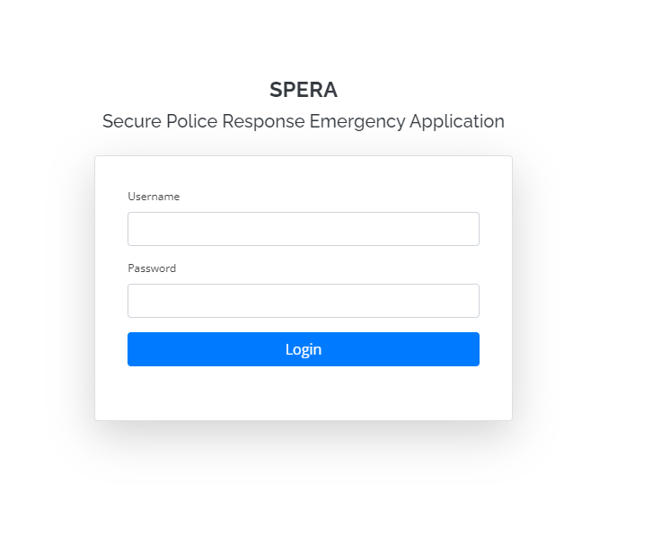
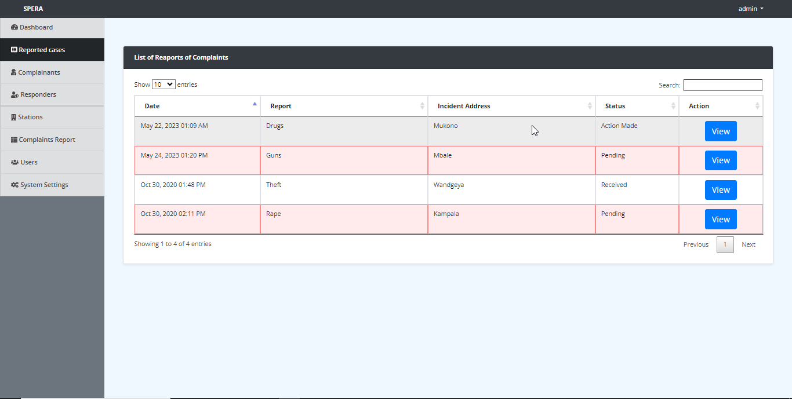
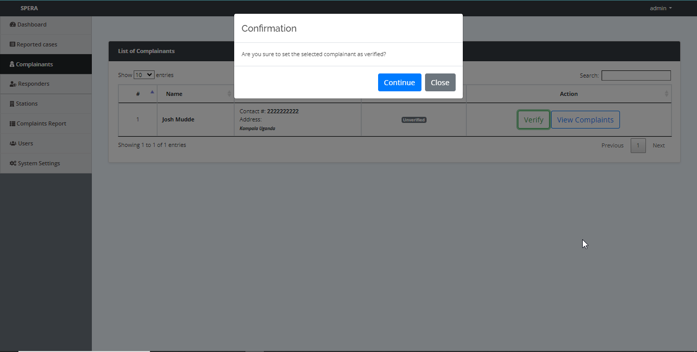
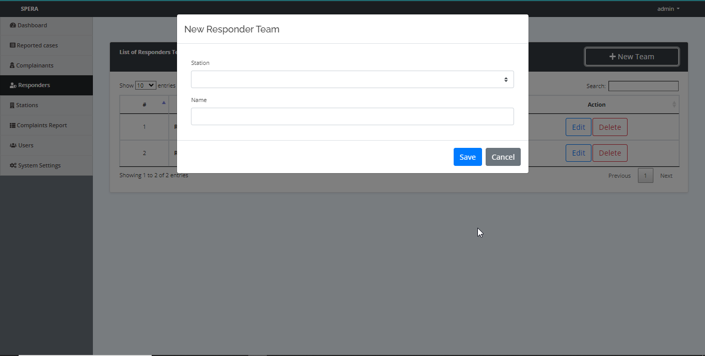
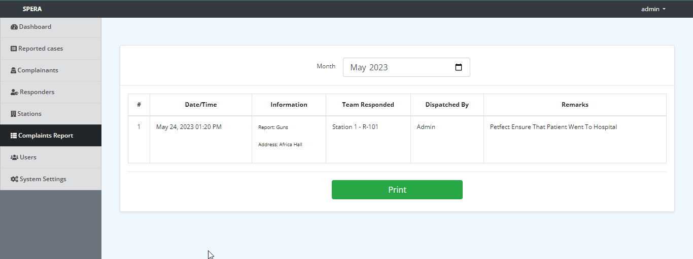

# Secure Police Response Emergency Application

## Usage

### Login/SignIn:

Admin Login/SignIn in into the System(Compulsory), Authentication is done through phpmyAdmin (Check db_connect.php)

### Review Reported Cases via Dashboard:

This is the dashboard screen where the police( Admin reviews Complaints)

### Reporter Verification:

The Genuine reporters can be marked as verified.

### Assigning responding team:

The responsible Law enforcement team is assigned to deal with a given reported case

### Generate Police report:

Once all constraints are satisfied, a report can be genrated and forwarded to Responsible parties

## 🔧 Setting up Local Development

### Step 1

Download and run Xampp/Wamp on windows or Mampp om macOS

### Step 2

Move project into htdocs 

### Step 3

Import database via phpMyAdmin and Run the project through localhost 

### Step 4

Modify to suite your needs. Its opensource afterall, a free lisence Haha. Goodluck